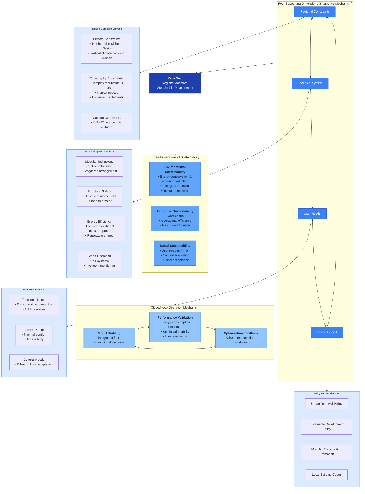

# Conceptual Framework for Regional Adaptive Sustainable Design of Container-based Urban Smart Pavilions



## Framework Description

### Core Elements
1. **Core Goal**: Regional Adaptive Sustainable Development
2. **Four Supporting Dimensions**:
   - Regional Constraints (Climate/Topography/Culture)
   - Technical System Optimization (Modular/Energy-efficient/Smart operation)
   - User Need Response (Functionality/Comfort/Cultural)
   - Policy Synergy Support (Policies/Codes/Promotion)
3. **Three Sustainability Dimensions**: Environmental, Economic, Social
4. **Operation Mechanism**: Model Building → Performance Validation → Optimization Feedback (closed-loop)

### Logical Relationships
The framework follows the "Constraints-Needs-Support-Optimization" logical chain, where all elements interact and influence each other to form an organic whole.

### Key Features
- **Regional Adaptability**: Specifically designed for Southwest China's geographical and cultural characteristics
- **Sustainable Integration**: Balances environmental, economic, and social sustainability
- **User-centered Design**: Responds to diverse user needs across different ethnic regions
- **Policy Alignment**: Supports and leverages existing urban development policies
```
